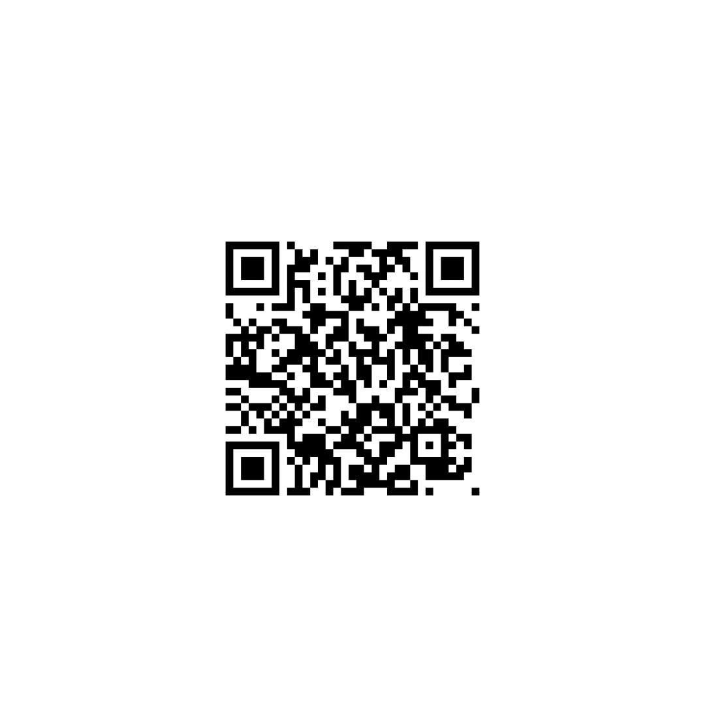

# Marketing Message

## Short One-Sentence Message

RSU Nexus is a trusted campus marketplace where RSU students can borrow, rent, share, and offer equipment, learning resources, and student services in one place.

---

## Channel-Specific Messages

| Channel | Message | CTA | Link/QR Placeholder |
|---------|---------|-----|---------------------|
| Class Chat | Need equipment, learning resources, or student services? Discover, borrow, rent, or offer them through RSU Nexus. | Try RSU Nexus | [ict-105-quartet-mvp-5jhf.vercel.app] |
| Email | We are testing RSU Nexus, a campus marketplace where students can easily borrow, rent, share, and offer resources and services. Your feedback will help improve the platform. | Give Feedback | [ict-105-quartet-mvp-5jhf.vercel.app] |
| Campus Poster / QR | Looking for equipment, tutors, textbooks, or student services? Scan the QR code and explore RSU Nexus today. | Scan QR | [| Campus Poster / QR | Looking for equipment, tutors, textbooks, or student services? Scan the QR code and explore RSU Nexus today. | Scan QR |  |] |
| Instagram / Facebook | One campus. One marketplace. Discover equipment, learning resources, and student services with RSU Nexus. | Explore Now | [https://ict-105-quartet-mvp-5jhf.vercel.app] |

---

## Message Quality Check

- ✔ Is the message clear within 5 seconds?
- ✔ Does it identify the target user (RSU students)?
- ✔ Does it explain the product benefit?
- ✔ Does it include one clear call-to-action (CTA)?
- ✔ Does it avoid exaggerated or unrealistic claims?
